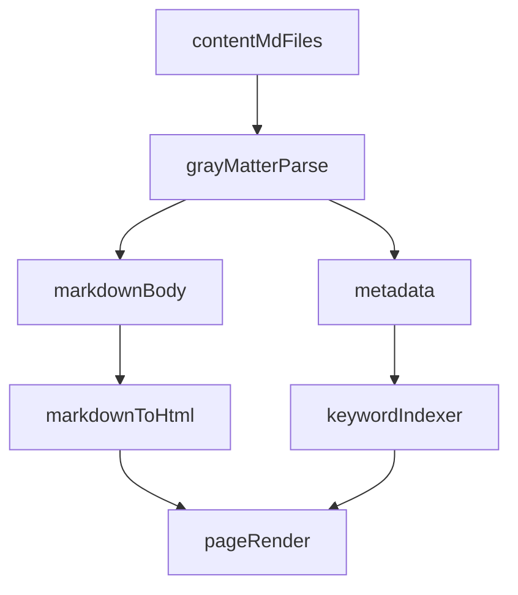

# 콘텐츠 파이프라인

이 문서는 “백엔드 처리 과정”을 콘텐츠 파이프라인 관점에서 설명합니다. 별도 서버 없이, 빌드/서버 컴포넌트에서 파일 시스템을 읽어 정적 페이지를 생성합니다.

## 전체 흐름

## 콘텐츠 루트 해석

`src/lib/content.ts`의 `resolveContentRoot()`가 다음 우선순위로 `content/`를 탐색합니다.

- `GITHUB_WORKSPACE`
- `process.cwd()`
- `__dirname`

로컬/CI 환경 모두에서 안정적으로 `content/`를 찾기 위한 전략입니다.

## 메타데이터/키워드 파싱

- `parseKeywords()`는 문자열(콤마 구분)과 배열을 모두 지원합니다.
- `parseMetadata()`는 누락 값에 기본값을 적용하고, `category`는 `technical/general` 외 값이면 `technical`로 보정합니다.

## 문서 로딩/정렬

- `getAllDocuments(type)`는 `content/questions|studies`를 읽고 `updatedAt` 기준 내림차순 정렬합니다.
- `getDocumentBySlug(type, slug)`는 파일이 없을 때 디버깅 정보를 포함한 에러를 던집니다.

## Markdown → HTML 변환

`src/lib/markdown.ts`의 `markdownToHtml()`이 아래 흐름으로 변환합니다.

- `remark` → `remark-gfm` → 키워드 자동 링크 → `remark-rehype` → `rehype-highlight` → `rehype-stringify`
- 키워드 자동 링크는 `code`, `inlineCode`, `link`, `linkReference`, `heading` 내부는 제외합니다.

## 키워드 인덱싱

- `getAllKeywordsByCategory()`는 `technical/general`로 키워드를 나눠 홈에서 사용
- `getDocumentsByKeyword(keyword)`는 키워드별 문서 목록을 생성
- `getAllStaticKeywords()`는 키워드 페이지의 `generateStaticParams()`에 사용
